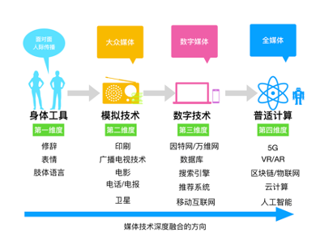

# 媒体融合案例数据库

## 简介

本研究将从媒体深度融合的视角出发，首先梳理媒介融合理论当中的关于媒体融合的研究，建立媒体融合案例库；然后，采用内容分析的方法分析媒体融合策略及其效果；最后，采用统计分析的方法分析不同的策略对融合效果的影响。根据研究问题与假设，本文使用内容分析法对媒体融合案例中的策略和效果进行分析。中国知网（CNKI）数据库中拥有海量的媒体融合案例分析论文，且案例描述较为详尽，更易了解媒体融合的过程和结果。于是本文选取CNKI数据库中的与“媒体融合”相关度排序最高的前2000篇论文进行人工筛选，得出163个媒体融合具体案例。

| 一级主题词           | 二级主题词   | Kappa系数                                                    | 编码方式                       | 同义词举例                       |
| -------------------- | ------------ | ------------------------------------------------------------ | ------------------------------ | -------------------------------- |
| 媒体属性             | 层级         | 1.000­                                                       | 1-中央 2-省 3-市县             |                                  |
| 媒体类型             | 1.000        | 1-报纸 2-电视 3-网络 4-出版 5-广播                           |                                |                                  |
| 地理位置             | 1.000        | 1-华北 2-东北 3-华东 4-华中 5-西南 6-西北 7-华南 8-港澳台地区 9-未知/其他 |                                |                                  |
| 所有制               | 1.000        | 1-公有制 2-非公有制                                          |                                |                                  |
| 媒介融合策略         | 资本策略     | 0.852                                                        | 1-实施此策略    0-未实施此策略 | 投资、挂牌证券系统、融资、众筹等 |
| 基础设施策略         | 0.843        | 云平台、数据平台、中央厨房等                                 |                                |                                  |
| 接入渠道策略         | 1.000        | 建立新媒体矩阵，包括自建APP、入驻微信微博等                  |                                |                                  |
| 第三方合作策略       | 0.801        | 与其他公司、媒体合作等                                       |                                |                                  |
| 组织融合策略         | 0.803        | 合并广电纸媒等形成公司/集团                                  |                                |                                  |
| 人才策略             | 0.811        | 高薪聘请人才、高校引进人才、职员培训等                       |                                |                                  |
| 经营管理策略         | 0.919        | 媒体内部市场化改革、员工激励政策（股份）、开设公司等         |                                |                                  |
| 政治帮扶策略         | 1.000        | 结对子、政策扶持等                                           |                                |                                  |
| 技术融合策略         | 0.811        | 应用AI写作、AI主播、无人机、VR/AR等新技术                    |                                |                                  |
| 市场策略             | 0.804        | 打造品牌效应（投放大屏、投放广告做宣传）、分众化传播         |                                |                                  |
| 内容策略             | 0.922        | 提升内容质量、版面效果；增加政务和本地化信息服务             |                                |                                  |
| 报告效果年份         | 报告效果年份 | 1.000                                                        | 具体年份                       |                                  |
| 是否报告效果         | 粉丝量       | 0.833                                                        | 1-有效果 0-无效果              |                                  |
| 下载量/点击量/发行量 | 0.843        |                                                              |                                |                                  |
| 营收                 | 0.865        |                                                              |                                |                                  |
| 报告效果强度         | 粉丝量       | 0.819                                                        | 2-强 1-弱 0-无                 |                                  |
| 下载量/点击量/发行量 | 0.868        |                                                              |                                |                                  |
| 营收                 | 0.808        |                                                              |                                |                                  |

借鉴Weber (1990)提出的内容分析步骤，首先，将分析单元设置为每篇提及媒体融合案例的文献；第二，在正式分析前，两位编码员分别对50篇样本进行预分析，统一编码类目；同时计算一致性系数kappa系数，如果系数较低，则对编码标准进行讨论、修改和重新编码，循环这些步骤直至kappa系数大于0.8 。在此基础上，两位编码员通过从媒体属性、是否采取融合措施以及融合效果三个方面对全部样本进行解读及编码，两位编码员再交替对对方编码的样本中的20%重新进行编码，计算一致性系数，如果通过则编码完成。

媒体属性方面，通过媒体的层级、类型、所在地、所有制来进行衡量；策略分为11个具体策略，资本策略、基础设施策略、接入渠道策略、第三方合作策略、组织融合策略、人才策略、经营管理策略、政治帮扶策略、技术融合策略、市场策略、内容策略；效果则主要从经济效果进行衡量，由粉丝量（包括微博、微信等新媒体平台的粉丝数）、下载量/点击量/发行量（自建app在各大手机市场的下载量、网站点击量、以及报纸或杂志等发行量）、营收（总收入）组成，最终将三个维度按照最大值取值转化为变量“总效果”。除了文章中是否报告效果以外，编码员还对效果的强/弱进行了区分。

具体编码如表1所示，且每个类目的Kappa系数均大于 0.8，信度较高。163个案例中包含了全国各个地区、不同规模、不同类型的融合案例，外部效度较高。两位编码员标准统一且遵守互不干扰的原则，独立完成编码工作，保证编码结果的内部效度。本文将使用Python 3.7进行后续的数据分析。
